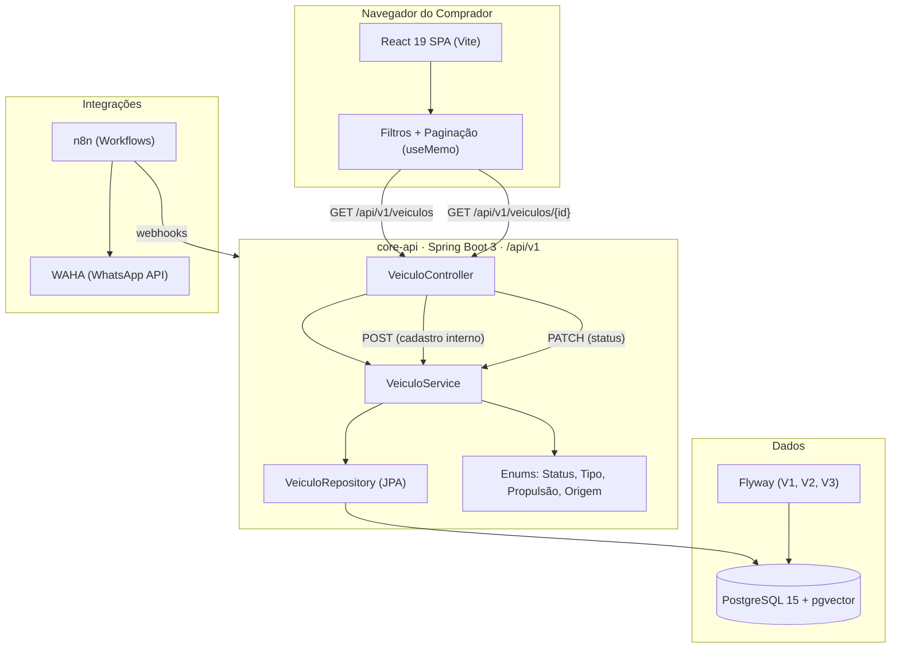

# 🚗 Esquina Veículos

<p align="center">
  <strong>Plataforma de catálogo, gestão e venda de veículos seminovos e usados.</strong>
</p>

React · TypeScript · Spring Boot · PostgreSQL · Docker

Repositório: [soninhoxs/esquina-veiculos](https://github.com/soninhoxs)

---

## Sobre o projeto

O **Esquina Veículos** é um catálogo automotivo profissional para lojas de veículos seminovos. O vendedor cadastra o carro com fotos tiradas pelo celular, define preço e status. O comprador navega pela vitrine pública, filtra por marca, modelo e faixa de preço, abre o detalhe e entra em contato por WhatsApp. A plataforma foi pensada para um cenário real: pátio com dezenas de carros e motos, fotos em qualquer orientação, vendedores sem experiência técnica e clientes acessando pelo celular em rede 4G.

### Problema

Catálogos automotivos tradicionais sofrem de três falhas recorrentes:

1. **Fotos distorcidas.** O vendedor tira foto vertical pelo celular. O site recebe a imagem em formato retrato (3:4) e encaixa num container landscape (16:9) com `object-fit: cover`, cortando a metade do carro. Ou usa `object-fit: fill` e estica a imagem até deformar. Resultado: o comprador não confia no anúncio.

2. **Payload monstruoso.** A API devolve todos os veículos do banco num único JSON — sem paginação, sem filtros no servidor, sem DTOs. Num pátio com 200 carros, isso significa 10 MB de JSON bruto no celular do comprador. A página trava, o Chrome mata a aba, e o dono da loja acha que "o site está fora do ar".

3. **Dados sensíveis expostos.** A placa completa, o chassi, o Renavam e o preço de compra trafegam no JSON público. Qualquer concorrente ou golpista abre o DevTools, copia a placa e consulta débitos, multas e histórico do veículo. Clonagem de placa começa assim.

### Solução

- **Container de altura fixa + `object-fit: contain`.** A galeria do card e do modal usa um container com dimensões travadas (`position: absolute; inset: 0`). A imagem cabe dentro sem corte e sem distorção. Os botões de navegação do carrossel usam `top: 50%; transform: translateY(-50%)` sobre o container pai (não sobre a imagem), garantindo centralização imutável independente da proporção da foto.

- **Paginação real no frontend (12 por página).** O catálogo exibe 12 veículos por página com controles de paginação, contadores e auto-reset ao trocar filtros. Quando conectarmos ao backend, isso vira `Pageable` no Spring Data JPA — a query monta `LIMIT 12 OFFSET n`, não `SELECT *`.

- **Mascaramento de dados sensíveis.** A placa completa não existe no payload público. O frontend recebe `placaMascarada` (`ABC-***4`) e `finalPlaca` (`4`). O chassi e o Renavam não trafegam de jeito nenhum. Preço de compra e margem do lojista ficam restritos à futura tela administrativa autenticada.

- **Um Compose.** Frontend Vite + API Spring Boot + PostgreSQL pgvector + n8n + WAHA; cada serviço com health check. O banco sobe com `pg_isready`, a API só sobe depois que o Postgres está healthy.

---

## Arquitetura



**Fluxo:** o browser só fala com a vitrine pública. Listagem e filtros rodam no SPA com `useMemo`. Quando a integração com o backend estiver conectada, GET passa pelo `VeiculoController`, que delega ao `VeiculoService`. Cadastro valida placa única e monta a entidade com `VeiculoStatus.DISPONIVEL`. Mudança de status passa pela regra de negócio: **IA não pode marcar como VENDIDO** — só humano fecha venda. Flyway versiona o schema em 3 migrações: tabela base, categorias/leilão e placa.

---

## Contrato da API

| Método | Endpoint | Papel | Por que este verbo |
|--------|----------|-------|--------------------|
| `GET` | `/api/v1/veiculos` | Lista todos (futuro: paginada + filtros) | Leitura; pode ir em cache |
| `GET` | `/api/v1/veiculos/{placa}` | Detalhe por placa | Leitura pontual |
| `POST` | `/api/v1/veiculos` | Cadastro (placa validada, status = DISPONIVEL) | Recurso novo |
| `PATCH` | `/api/v1/veiculos/{placa}/status` | Muda status (com regra de IA) | Atualização parcial; header `X-Source` distingue humano de IA |

**Não há** `PUT` (substituiria campos imutáveis como placa), `DELETE` (fora do recorte atual) nem tela de login (a ser implementada).

---

## Decisões de engenharia

**Regra de negócio no Service, não no Controller.** O `VeiculoService` concentra a validação de placa duplicada e a regra de transição de status. O controller é uma casca fina que recebe o request, delega e devolve o DTO. Isso significa que se amanhã tivermos um CLI, um webhook do n8n ou um agent de IA chamando a mesma lógica, a regra não precisa ser replicada.

**Enums Java para domínio fechado.** `VeiculoStatus` (DISPONIVEL, EM_NEGOCIACAO, VENDIDO), `TipoVeiculo` (CARRO, MOTO, BICICLETA, CAMINHAO), `OrigemLeilao` (NENHUM, SINISTRO_PEQUENA_MONTA, SINISTRO_MEDIA_MONTA, FINANCEIRA) e `Propulsao` (COMBUSTAO, ELETRICO, HIBRIDO, HUMANA) são enums. O banco grava a string (`@Enumerated(EnumType.STRING)`), o que evita mágica de ordinais e torna a coluna legível num `SELECT` direto. O Jackson serializa e desserializa automaticamente.

**IA não fecha venda.** O `PATCH` de status aceita um header `X-Source`. Se o valor for `IA`, o service rejeita a transição para `VENDIDO` com `IllegalStateException`. A decisão é intencional: a IA pode sugerir negociação, ajustar preço ou mover para análise, mas a assinatura final de venda é humana. Isso protege contra automações descontroladas e alinha com a expectativa do lojista.

**Flyway para schema versionado.** As 3 migrações (`V1` tabela base, `V2` categorias e leilão, `V3` placa com índice único) correm no boot da aplicação. Não há `ddl-auto=update` no Hibernate — o Flyway é a única fonte de verdade do schema. Isso evita surpresas em produção onde o Hibernate decide dropar uma coluna ou recriar um índice.

**Placa como chave de negócio, UUID como chave técnica.** A entidade usa `UUID` como `@Id` (gerado pelo banco), mas a placa é `UNIQUE` e serve como identificador de negócio nas rotas REST. Se o veículo for transferido entre lojas de uma rede, o UUID muda mas a placa permanece rastreável.

**Fotos em `text[]` no PostgreSQL.** A coluna `fotos` é um array nativo do Postgres (`text[]`), mapeada com `@JdbcTypeCode(SqlTypes.ARRAY)`. Cada posição guarda uma URL. Isso evita uma tabela extra de junção (`veiculo_fotos`) para um caso simples: o vendedor sobe 3-5 fotos por carro, não milhares. Se escalar, migramos para S3 + CDN com as mesmas URLs.

**Dados sensíveis segregados por camada.** No frontend público, a placa real nunca chega ao navegador — apenas `placaMascarada` e `finalPlaca`. O `VeiculoResponseDTO` do backend ainda expõe a placa para uso interno (painel administrativo). Quando implementarmos autenticação, criaremos um `VeiculoPublicoDTO` que omite placa, chassi e margem.

**Vanilla CSS com design system autocontido.** Todo o estilo mora em um único `store.css` com variáveis CSS (`:root`), sem TailwindCSS, Bootstrap ou qualquer framework. A decisão foi intencional: o CSS de um catálogo automotivo é específico demais para classes utilitárias genéricas. Um `.carousel-nav` com `top: 50% !important; transform: translateY(-50%) !important` resolveu o bug de centralização que frameworks não endereçam — eles assumem que o container não muda de altura, e com `object-fit: contain` em fotos verticais, muda.

**`useMemo` para filtragem, não `useEffect`.** Os filtros (marca, modelo, preço, busca) derivam a lista filtrada com `useMemo`, não com `useEffect` + estado separado. Isso evita um render extra e a armadilha clássica de `useEffect` que dispara em loop quando a dependência é o próprio array filtrado.

---

## Segurança e privacidade

| Controle | Como | Risco evitado |
|----------|------|---------------|
| **Placa mascarada** | Frontend recebe `placaMascarada` (`ABC-***4`) e `finalPlaca` (`4`); placa real não trafega | Clonagem de placa, consulta abusiva no DETRAN |
| **Chassi e Renavam** | Não existem no DTO público | Fraude documental, transferência ilegal |
| **Margem de lucro** | Preço de compra não existe no frontend | Espionagem de concorrentes |
| **Bind local** | Docker expõe Postgres em `127.0.0.1:5432`, não em `0.0.0.0` | Acesso externo ao banco |
| **Health check** | `pg_isready` no Postgres; API depende de `service_healthy` | Container sobe sem banco pronto |
| **Build de produção** | Vite minifica e elimina caminhos locais (`C:/Users/...`) e source maps | Exposição de estrutura interna |

---

## Performance

| Métrica | Desenvolvimento (`npm run dev`) | Produção (`npm run build`) |
|---------|--------------------------------|---------------------------|
| Requisições | 31 | 18 |
| Transferido | 9.7 MB (com HMR e source maps) | 612 B (gzipped) |
| JS bundle | — | 77.84 kB gzip |
| CSS bundle | — | 2.57 kB gzip |
| Build time | — | 235 ms |
| Caminhos locais expostos | Sim (esperado em dev) | Zero |

A paginação de 12 veículos por página evita renderizar 50+ cards simultaneamente. Cada card instancia seu próprio `useState` para o carrossel, isolando re-renders.

---

## Estrutura do projeto

```
esquina-veiculos/
├── core-api/                          # Backend Spring Boot 3 (Java 21)
│   ├── src/main/java/.../veiculo/
│   │   ├── Veiculo.java              # Entidade JPA (UUID, placa, fotos em text[])
│   │   ├── VeiculoStatus.java        # Enum: DISPONIVEL, EM_NEGOCIACAO, VENDIDO
│   │   ├── TipoVeiculo.java          # Enum: CARRO, MOTO, BICICLETA, CAMINHAO
│   │   ├── OrigemLeilao.java         # Enum: NENHUM, SINISTRO_*, FINANCEIRA
│   │   ├── VeiculoRepository.java    # JPA (findByPlaca, existsByPlaca)
│   │   ├── VeiculoService.java       # Regras de negócio (IA ≠ VENDIDO)
│   │   ├── VeiculoController.java    # REST /api/v1/veiculos
│   │   ├── VeiculoRequestDTO.java    # Validação de entrada
│   │   └── VeiculoResponseDTO.java   # Projeção de saída (fromEntity)
│   ├── src/main/resources/
│   │   ├── application.properties
│   │   └── db/migration/
│   │       ├── V1__create_veiculo_table.sql
│   │       ├── V2__add_novas_categorias_e_leilao.sql
│   │       └── V3__add_placa_veiculo.sql
│   ├── pom.xml
│   └── Dockerfile
│
├── frontend/                          # SPA React 19 + TypeScript + Vite 8
│   ├── src/
│   │   ├── App.tsx                    # Vitrine, filtros, carrossel, modal, paginação
│   │   ├── main.tsx                   # Ponto de montagem
│   │   ├── data/
│   │   │   └── mockVehicles.ts        # 50 veículos (42 carros + 8 motos) com placas mascaradas
│   │   ├── styles/
│   │   │   └── store.css              # Design system completo (variáveis, grid, carrossel, modal)
│   │   └── types/
│   │       └── index.ts               # Interfaces (Veiculo, Filtros, PaginationData)
│   ├── dist/                          # Build de produção minificado
│   ├── package.json
│   └── vite.config.ts
│
├── docker-compose.yml                 # Frontend + core-api + PostgreSQL + n8n + WAHA
└── README.md
```

---

## O que falta

A tag `v1.0.0` (branch `main`) é a primeira versão. O trabalho seguinte fica em `desenvolvimento`.

A arquitetura não muda: o navegador fala com o Nginx, que serve a vitrine React e encaminha `/api` para o core-api. O PostgreSQL, via Flyway, é a fonte dos veículos. A vitrine pública continua anônima. Cadastro, status e fotos ficam em rotas de funcionário. n8n e WAHA entram depois, chamando a mesma API. O pgvector fica de fora até existir uma busca que o filtro não cubra.

Hoje a vitrine lê `mockVehicles.ts` e a API lê a tabela `veiculos`. As duas metades ainda não se falam.

### Trava o uso

| Peça | Hoje | Falta |
|------|------|--------|
| Catálogo | 50 veículos no mock, filtro e página de 12 no browser | `GET` paginado, filtros no servidor, vitrine sem mock |
| Placa pública | `VeiculoResponseDTO` devolve a placa completa | DTO público com `placaMascarada` e `finalPlaca`; detalhe por UUID |
| Erros | Placa duplicada e veículo ausente viram exceção genérica | `404`, `409`, `422` e `403` com corpo estável |
| Contato | Botões de WhatsApp e telefone no modal não abrem nada | `wa.me` com o texto do veículo e o telefone da loja |
| Acesso | `POST` e `PATCH` abertos, sem Spring Security | Login de funcionário; vitrine anônima |
| Painel | Não há tela de cadastro nem de status | Formulário interno: veículo, preço, fotos e status |
| Nginx | A imagem só entrega o `dist` | `try_files` da SPA e proxy `/api` para o core-api, no mesmo origem |
| Postgres | Porta `5432` publicada na rede, senha no Compose | Bind em `127.0.0.1` e senha só por variável de ambiente |

### Incompleto

- A descrição do modal é texto fixo. O selo "Abaixo da FIPE" aparece para qualquer preço abaixo de R$ 100 mil, sem fonte de FIPE.
- As abas da vitrine só mostram carro e moto. `BICICLETA` e `CAMINHAO` já existem no contrato.
- `propulsao` é `String` no Java e enum no TypeScript. Os dois lados passam a usar `COMBUSTAO`, `ELETRICO`, `HIBRIDO` e `HUMANA`.
- A placa é opcional e o índice único aceita vários nulos. No cadastro interno ela fica obrigatória, no formato antigo e no Mercosul.
- Fotos continuam em `text[]`. Falta o upload: o arquivo vai para um volume e a URL entra nesse array.
- `updateStatus` marca um TODO de auditoria, e a tabela `eventos_veiculo` não existe. A migração seguinte grava status anterior, status novo, origem e horário.
- Não há OpenAPI, Actuator nem teste das regras de placa duplicada e de venda por IA. O teste atual só sobe o contexto.

### Pode esperar

n8n, WAHA e o `agent-service` (hoje um `sleep infinity`) esperam o cadastro humano. O agente, quando existir, usa o mesmo `PATCH` e continua sem poder marcar `VENDIDO` quando `X-Source` é `IA`.

### Ordem

1. Ligar vitrine e API: DTO público, paginação, filtro no repositório, erros HTTP, enum de propulsão, proxy no Nginx e a vitrine deixando o mock.
2. A loja operar: login, painel, upload de foto, placa obrigatória, auditoria e Postgres preso ao localhost.
3. Automação: n8n e WAHA em cima da API já pronta.

### Contrato alvo

`GET /api/v1/veiculos` devolve página, com `tipo`, `marca`, `modelo`, `precoMax`, `status`, `temLeilao`, `busca`, `page` e `size=12`. Cada item traz `placaMascarada` e `finalPlaca`. Placa completa, preço de compra e documento ficam fora desse JSON. O detalhe público é `GET /api/v1/veiculos/{id}`, por UUID.

`POST` cria com status `DISPONIVEL` e placa validada. `PATCH` muda status. Essas rotas exigem sessão de funcionário. O header `X-Source: IA` continua bloqueado em `VENDIDO`.

---

## Como executar

### Pré-requisitos
- Node.js 18+
- Java JDK 21
- Docker & Docker Compose (opcional)

### Frontend

```bash
cd frontend
npm install
```

**Desenvolvimento** (HMR, source maps, código legível no DevTools):
```bash
npm run dev          # http://localhost:5173
```

**Produção** (minificado, sem caminhos locais, sem source maps):
```bash
npm run build        # gera dist/
npm run preview      # http://localhost:4173
```

### Backend

```bash
cd core-api
./mvnw spring-boot:run   # http://localhost:8080
```

### Docker Compose (todos os serviços)

```bash
docker compose up -d
```

| Serviço | Porta | Descrição |
|---------|-------|-----------|
| Frontend | 3000 | Vitrine pública |
| core-api | 8080 | API REST Spring Boot |
| PostgreSQL | 5432 | Banco de dados com pgvector |
| n8n | 5678 | Automação de workflows |
| WAHA | 3001 | WhatsApp API |

---

*Desenvolvido com foco em segurança, privacidade (LGPD), estética moderna e decisões de engenharia justificadas para a Esquina Veículos — Recife/PE.*
